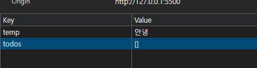

# todolist / shoppingglist의 script 분할
```html
<script src ="./01_todolist.js"> >/script> 
// body 태그 삽입

```

기준 script 태그 내부에 있떤 로직들을 전부 01_todolist.js로 잘라내기 - 붙여넣기 하고 alt + tab으로 들여쓰기 조정

```html
<script defer src="./01_todolist.js"> </script>
```

defer : html `<script>` 태그에 사용하는 속성 중 하나로, 스크립트 파일 다운 방식 제어.
defer 사용시에 웹 페이지에 html 피싱을 중단하지 않고 스크립트 로직을 다운 , 그리고 다운로드 완료 이후에 HTML 문서의 피싱이 끝나는 시점에 스크립트 실행.

- html 문서에 명시된 순서대로 실행 보장.

- 로직이 그렇게 복잡하거나 긴게 아니어서 안되는건 컴퓨터 문제일 확률이 높다.

# todolist 복습 
localStorage의 저장 방식 
key - value 쌍으로 우리어져있고, value에는 다양한 자료형이 들어갈 수 있다.

todolist에는 todos라는 key에 value로 배열이 들어가있고, 배열 내부 요소는 JS 객체 형태로 되어있다.
하지만 모든 localStorage의 value가 배열일 필요는 없다는 예시


내일 이후부터 html / css /js 복습을 위한 동영상 강의가 불시에 수강하라고 할 수 있다 . 유무선 이어폰 챙겨와야 함.